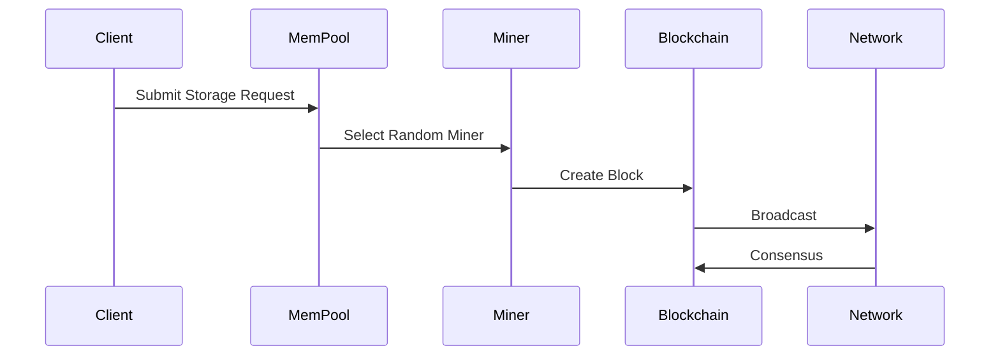

# Blockchain-Based Decentralized Storage System

## Project Overview
A Rust-based blockchain implementation providing decentralized storage with proof-of-storage validation and monetary incentives.

## Table of Contents
- [Core Components](#core-components)
- [Technical Specifications](#technical-specifications)
- [System Workflows](#system-workflows)
- [Implementation Details](#implementation-details)

## Core Components

### 🔷 Node System (`src/node.rs`)
- **Implementation**: Ed25519 cryptography-based network participants
- **Features**:
  - Unique identifier
  - Public/private keypair for signing
  - Message validation and signature verification
  - Peer discovery support

### 🔶 Blockchain Structure

#### Block (`src/block.rs`)
- **Core Components**:
  - Previous block hash (SHA-256)
  - UTC timestamp
  - Dual transaction support:
    - Storage Transaction (STX)
    - Monetary Transaction (MTX)
  - Content-derived block hash
- **Capabilities**:
  - Serialization/deserialization
  - Validation logic

#### Blockchain (`src/blockchain.rs`)
- **Management**:
  - Block chain (`Vec<Block>`)
  - File storage mapping (`HashMap<String, Vec<String>>`)
  - Node balances (`HashMap<String, f64>`)
- **Core Functions**:
  ```rust
  fn new_with_genesis_block() -> Self
  fn add_block(&mut self, block: Block) -> Result<(), Error>
  fn search_transaction(&self, tx_id: &str) -> Option<Transaction>
  fn verify(&self) -> bool
  fn update(&mut self) -> Result<(), Error>
  ```

### 🔷 Transaction Types (`src/transaction.rs`)
| Type | Purpose | Components |
|------|---------|------------|
| StorageTx | File storage | Metadata, Node assignment, Payment |
| ProofOfStorageTx | Validation | Challenge responses, Proofs |
| MonetaryTx | Payments | Balance transfers, Storage fees |
| QueryTx | Retrieval | File requests |
| ServeFileTx | Delivery | File content |

### 🔶 Network Architecture (`src/network.rs`)
- **Framework**: libp2p
- **Core Protocols**:
  ```rust
  - Gossipsub    // Message broadcasting
  - MDNS         // Peer discovery
  - TCP/QUIC     // Transport layer
  ```

### 🔷 Storage Validation

#### Proof of Storage System (`src/post.rs`)
```rust
pub trait ProofOfStorage {
    fn generate_challenge() -> Challenge;
    fn create_proof(challenge: Challenge) -> StorageProof;
    fn verify_proof(proof: StorageProof) -> bool;
    fn distribute_rewards(node: NodeId, amount: f64);
}
```

#### Random Election (`src/randomized_election.rs`)
- VRF-based selection
- Verifiable randomness
- Fair distribution

### 🔶 Memory Management (`src/mempool.rs`)
- **Queue System**:
  ```rust
  struct MemPool {
      pending_tx: Vec<Transaction>,
      file_cache: HashMap<String, Vec<u8>>,
      metadata: TransactionMetadata,
  }
  ```

## Technical Specifications

### Dependencies
```toml
[dependencies]
libp2p = "0.x"
ed25519-dalek = "1.x"
sha2 = "0.x"
serde = { version = "1.x", features = ["derive"] }
tokio = { version = "1.x", features = ["full"] }
```

### Security Features
- ✅ Cryptographic signatures (Ed25519)
- ✅ Hash chain validation (SHA-256)
- ✅ Proof of Storage verification
- ✅ Double-spend prevention
- ✅ Sybil attack resistance

## System Workflows

### File Storage Flow


### Storage Validation Cycle
1. 🎲 Challenge Generation
2. 📤 Proof Submission
3. ✅ Network Verification
4. 💰 Reward Distribution

### File Retrieval Process
```rust
async fn retrieve_file(file_id: String) -> Result<Vec<u8>> {
    1. Submit query
    2. Route through network
    3. Receive from storage node
    4. Verify contents
    5. Return file data
}
```

## Implementation Details

### Technical Stack
- **Language**: Rust 2021 edition
- **Architecture**: Async/await
- **Error Handling**: Result types
- **Serialization**: Custom formats
- **Threading**: Thread-safe components

### Development Setup
```bash
# Clone repository
git clone https://github.com/yourusername/blockchain-storage.git

# Start node
cargo run
```

### Testing Coverage
- Unit tests for core components
- Integration tests for workflows
- Network simulation tests
- Stress testing for validation

## License
MIT License - See LICENSE file for details

---

**Note**: For detailed API documentation, please refer to the `docs/` directory.
